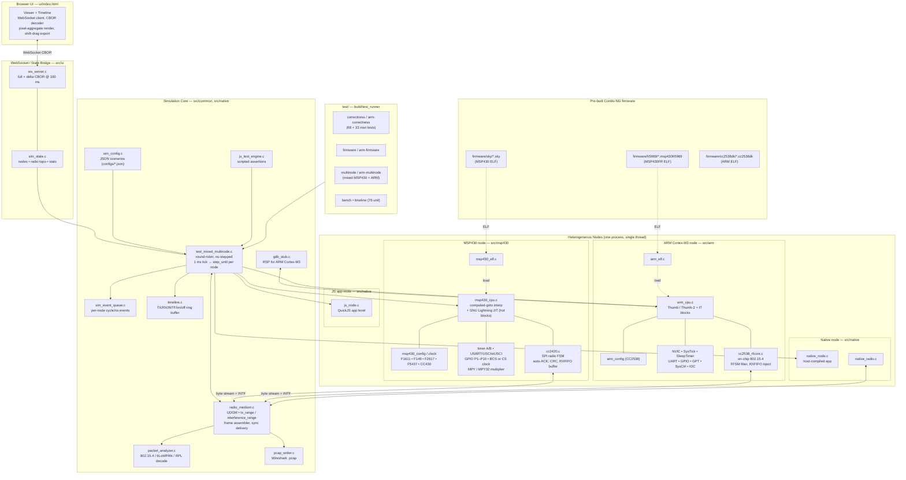

# CSIM / Cooja-NG Architecture



## Reading the diagram

- **Top to bottom = control / data flow.** Browser drives nothing — the simulation tick is owned by the multinode driver, which advances `sim_ns` by 1 ms and calls `*_step_until()` on every node.
- **Single-threaded, round-robin.** All nodes (MSP430, ARM, native, JS) live in one process; each has its own `sim_event_queue` and per-node cycles.
- **Radio medium is the only inter-node bus.** `radio_medium.c` does UDGM range checks, frame assembly, and synchronous delivery into `cc2420` / `cc2538_rfcore` — that's why auto-ACK lands in the same CPU step.
- **Timeline + WebSocket are observation-only.** They sample state; removing them doesn't change simulation outcomes.
- **JIT is MSP430-only**, optional, gated on GNU Lightning at build time.

## File inventory

`src/msp430/` and `src/arm/` are already tabled in `CLAUDE.md`. The rest of the tree:

### `src/common/` — shared infrastructure

| File                | Purpose                                                                                                         |
| ------------------- | --------------------------------------------------------------------------------------------------------------- |
| `elf_loader.c`      | Shared ELF32 loader used by both MSP430 and ARM ports                                                           |
| `gdb_stub.c`        | GDB Remote Serial Protocol server (sockets, hex codec, command dispatch); per-arch glue lives elsewhere         |
| `js_test_engine.c`  | COOJA-style JS test harness (QuickJS in a pthread, blocking `YIELD()` coroutine model fed by sim console lines) |
| `packet_analyzer.c` | 802.15.4 / 6LoWPAN / IPv6 / RPL frame decoder for logs and timeline                                             |
| `pcap_writer.c`     | libpcap nanosecond-precision writer for Wireshark consumption                                                   |
| `radio_medium.c`    | Per-radio medium: spectrum + channel + RX-enabled gating, distance-based RX probability, xorshift32 PRNG, 802.15.4 + 802.15.4g frame trackers. Detailed reference: [`docs/radio-medium.md`](radio-medium.md). |
| `sim_event_queue.c` | Min-heap event queue keyed on `(time_ns, seq)` for FIFO at equal times (matches COOJA)                          |
| `sim_threads.c`     | Optional thread pool with atomic spin barrier for parallel per-node steps                                       |
| `timeline.c`        | Ring buffer of TX/RX/INTF/LED/log events, JSON + CBOR serialization                                             |

### `src/native/` — non-emulated node types

| File | Purpose |
|------|---------|
| `native_node.c` | `TARGET=cooja` Contiki-NG `.cooja` shared lib loaded via `dlopen` (per-node temp copy); exposes `cooja_init/cooja_tick` |
| `native_radio.c` | Bridges native Cooja frame-based radio (`simInDataBuffer`) ↔ byte-stream 802.15.4 used by CC2420/CC2538 |
| `js_node.c` | JS application mote: per-node QuickJS runtime, single-threaded, ticked from the main loop (distinct from `js_test_engine.c`) |
| `sim_config.c` | JSON scenario loader (`configs/*.json`) — node positions, firmware paths, radio model |

### `src/ui/` — observation/visualization bridge

| File | Purpose |
|------|---------|
| `ws_server.c` | Non-blocking WebSocket server: select() loop, embedded HTML on `GET /`, upgrade on `/ws`, ≤8 clients, SHA-1 + base64 handshake |
| `sim_state.c` | Serializer: JSON `full` snapshot on connect, CBOR `delta` every 100 ms |

### `test/` — `build/test_runner` subcommands

| File | Purpose |
|------|---------|
| `test_main.c` | Dispatcher for all subcommands (`correctness`, `bench`, `firmware`, `multinode`, `arm-*`, `timeline`) |
| `test_correctness.c` | 68 MSP430 instruction-level correctness tests (port of MSPSim's `CorrectnessTests.java`) |
| `test_arm_correctness.c` | 33 ARM Cortex-M3 instruction-level tests |
| `test_benchmark.c` | MSP430 micro-benchmarks + firmware benchmarks (port of `PerformanceBenchmark.java`) |
| `test_firmware.c` | MSP430 firmware boot tests; loads ELF, monitors USART output |
| `test_arm_firmware.c` | ARM firmware boot tests; loads CC2538 ELF, monitors UART |
| `test_mixed_multinode.c` | Heterogeneous multi-node sim driver (MSP430 + ARM + native + JS); auto-detects platform from file extension |
| `test_timeline.c` | 76 unit tests for timeline ring buffer, serialization, sub-ms timestamp precision |

### `tools/` — scripts (selected)

| File | Purpose |
|------|---------|
| `run-cooja-tests.sh` | Run COOJA test scripts under csim |
| `compare-cooja-timing.sh` | Diff csim timing vs reference COOJA |
| `csc2json.py` | Convert COOJA `.csc` scenarios to csim JSON |
| `dump-pcap.py` | Pretty-print captured `.pcap` |
| `slip-prefix-sender.py` | Inject IPv6 prefix into a SLIP border router |
| `test-gdb-stub.py` | Smoke test for `gdb_stub.c` |
| `ws_debug.py` | Connect to `ws_server.c`, dump CBOR deltas |
| `build-cooja-firmware.sh`, `build-test-firmware.sh` | Cross-compile Contiki-NG firmware for sky / cc2538dk |

## Emulation API: how the CPU talks to peripherals

Same conceptual model as MSPSim, rewritten in C with function pointers and a dual-time clock.

### MCU ↔ peripheral dispatch

**MSPSim (Java)** — every memory-mapped byte holds a reference to an `IOUnit`; reads/writes dispatch through that array. Peripherals subclass `IOUnit`.

**csim (C)** — function pointers, two flavors:

```c
/* MSP430 — per-address dispatch (dense 16-bit IO at 0x0000–0x01FF) */
typedef int  (*io_read_fn) (void *user_data, uint32_t addr, bool word, int64_t cycles);
typedef void (*io_write_fn)(void *user_data, uint32_t addr, int value, bool word, int64_t cycles);
void msp430_register_io(cpu, addr, size, read, write, data);
                              /* populates cpu->io_read[addr..addr+size]    */

/* ARM — region table (sparse 1 GB IO at 0x40000000) */
typedef int  (*arm_io_read_fn) (void *user_data, uint32_t addr);
typedef void (*arm_io_write_fn)(void *user_data, uint32_t addr, uint32_t value);
void arm_register_io(cpu, base, size, read, write, data);
                              /* appends to cpu->io_regions[64], linear scan */
```

The two architectures use different shapes for the same reason MSPSim does: MSP430 has a dense 16-bit IO page (per-address table is fastest); the Cortex-M3 IO range is huge and sparse (a small region array is better).

### Interrupts

```c
/* MSP430 — flag/clear, plus a per-vector ISR-entry callback */
msp430_flag_interrupt(cpu, vector, source, handler, set);
                          /* set=true raises, set=false clears.            */
                          /* `handler(source, vector)` is invoked when the */
                          /* CPU enters the ISR — same contract as MSPSim's
                             IOUnit.interruptServiceRoutine().             */

/* ARM — real NVIC, peripherals call into it directly */
arm_nvic_set_pending(nvic, IRQ_RFCORE_RXTX);
```

### Event queue (the big departure from MSPSim)

MSPSim's queue is cycle-only. csim's is **dual-time**:

```c
typedef struct msp430_event {
    int64_t  fire_cycle;
    int64_t  fire_ns;     /* 0 = cycle-based; non-zero = wall-clock */
    event_fn callback;
    void    *user_data;
} msp430_event_t;

msp430_schedule_event   (cpu, ev, cycle);   /* fire at CPU cycle      */
msp430_schedule_event_ns(cpu, ev, ns);      /* fire at wall-clock ns  */
msp430_cancel_event     (cpu, ev);
```

The hot loop only checks `cycles >= next_event_cycle`. ns events are shadowed onto `fire_cycle` at the *current* `cpu_freq_hz`; when firmware reprograms the DCO, `msp430_cpu_set_frequency()` syncs `sim_time_ns` and re-projects every ns event onto the new cycle base. This is what lets CC2420 use real µs/ns symbol timing (16,000 ns/symbol, 1 ms VREG startup) regardless of DCO calibration.

### Cooja/MSPSim compatibility shims

To slot into the same drivers and tests:

```c
int64_t msp430_step_micros(cpu, jump_us, execute_us);   /* MSPSim's stepMicros */
void    msp430_step_until (cpu, target_cycle);          /* native fast path    */
int     msp430_step       (cpu, count);                 /* by-instruction      */
```

`last_micros_cycles` / `last_micros_delta` / `step_cycle_remainder` mirror MSPSim's stepMicros bookkeeping.

### Summary table

| Aspect            | MSPSim                              | csim                                                                  |
| ----------------- | ----------------------------------- | --------------------------------------------------------------------- |
| MCU↔peripheral    | `IOUnit` vtable, per-byte map       | Function pointers — per-byte (MSP430) / per-region (ARM)              |
| Interrupt raise   | `flagInterrupt` + ISR callback      | `msp430_flag_interrupt` + handler callback (ARM uses NVIC)            |
| Event queue       | Cycle-only                          | **Cycle + ns**, projected on frequency change                         |
| Time base         | Cycles                              | Cycles (hot) + `sim_time_ns` (peripherals/radio)                      |
| Driver entrypoints| `stepMicros`, `executeUntil`        | Same plus native `step_until(target_cycle)`                           |
| Dispatch          | Switch / interpreter                | Computed-goto interpreter + optional GNU Lightning JIT (MSP430 only)  |

## Off-SoC chips: how external sensors and radios are wired

Boards differ in *which* chips sit outside the SoC and *how* they connect. csim mirrors the real PCB wiring through three small bridge APIs — SPI, GPIO output (MCU drives chip), GPIO input (chip drives MCU) — plus a couple of specialty hooks for capture timers and radio buses.

### Chip placement per platform

| Platform   | MCU             | Radio          | Other off-chip   | Wiring                                                                  |
| ---------- | --------------- | -------------- | ---------------- | ----------------------------------------------------------------------- |
| **sky**    | MSP430F1611     | CC2420 *off*   | —                | SPI via USART0; CS/VREG on GPIO; FIFO/FIFOP/CCA/SFD as input pins       |
| **z1**     | MSP430F2617     | (no radio)     | M25P16 flash     | Shared SPI bus (USCI-B0); CS distinguishes flash vs would-be CC2420     |
| **esb**    | MSP430F149      | TR1001 (n/m)   | —                | Currently stubbed                                                       |
| **wismote / exp5438 / cc430** | F5437 / CC430F5137 | None | — | —                                                                |
| **fr5969** | MSP430FR5969     | (no radio)     | —                | FRAM-based MSP430X with eUSCI (per-module IFG/IE) and CS clock module (DCO lookup table, password-unlock); MPY32 32×32→64 multiplier |
| **cc2538dk** | CC2538 (Cortex-M3) | RF Core *on-chip* | —          | Memory-mapped at `0x40088000` + FFSM regs; NVIC IRQ direct              |
| **openmote** | CC2538 (Cortex-M3) | RF Core *on-chip* | —          | Same as cc2538dk; only board glue (LEDs / button) differs               |
| **zoul-firefly** | CC2538 (Cortex-M3) | RF Core *on-chip*; CC1200 *off* (sub-GHz) | — | RF Core same as cc2538dk. CC1200 driver (`src/arm/cc1200.c`, `sim_host_t`-only) over SSI0 (`src/arm/cc2538_ssi.c`) with CSn=PB5, RESET=PC7, GDO0=PB4, GDO2=PB0. Per-node radio fan-out in `test_mixed_multinode.c` feeds delivered bytes to both chips; `radio_medium`'s reserved sub-GHz channel range (≥`RADIO_MEDIUM_SUBGHZ_CHANNEL_BASE`) plus a `cross_band_drop()` filter keeps the two bands isolated without a true dual-radio refactor. |

### Five bridge APIs that wire any off-SoC chip

#### 1. SPI bus — MCU → chip, byte-at-a-time

The MSP430 USART exposes a single callback. Whoever owns the SPI bus installs one exchange function; that function fans out to whichever chip is currently selected.

```c
typedef int (*usart_spi_exchange_fn)(void *user_data, uint8_t tx_byte);
void msp430_usart_set_spi_exchange(usart, fn, data, rx_buf_offset);

/* Sky/Z1 platform glue (msp430_platform.c) */
static int platform_spi_exchange(void *data, uint8_t byte) {
    msp430_platform_t *plat = data;
    if (plat->config->mcu->is_msp430x && plat->flash.chip_select)
        return flash_spi_exchange(plat, byte);   /* M25P16 on Z1 */
    if (plat->config->cc2420.has_cc2420)
        return cc2420_spi_exchange(&plat->cc2420, byte);
    return 0;
}
```

This is exactly the Sky/Z1 PCB: the USART pumps a byte; whichever chip's CS is asserted gets it.

#### 2. GPIO output callback — MCU → chip control pins (CS, VREG, RESET)

The GPIO peripheral fires a callback whenever `PxOUT` changes. The platform watches for transitions on the pins assigned to each chip and calls into the chip's API:

```c
typedef void (*gpio_output_callback_fn)(void *user_data, int port,
                                         uint8_t old_out, uint8_t new_out);
void msp430_gpio_set_output_callback(gpio, cb, data);

static void platform_gpio_changed(void *d, int port, uint8_t old_, uint8_t new_) {
    /* ... per-pin masking ... */
    if (cs_pin_changed)   cc2420_set_chip_select(&plat->cc2420, !cs_active);
    if (vreg_pin_changed) cc2420_set_vreg       (&plat->cc2420,  vreg_on);
    if (z1_flash_cs_changed) plat->flash.chip_select = !cs_high;
}
```

#### 3. GPIO input pin — chip → MCU status/interrupt pins (FIFO, FIFOP, CCA)

The chip drives MCU input pins from inside its state machine. The GPIO peripheral handles edge detection, IES/IE/IFG bookkeeping, and raises a vector if enabled — exactly the path real firmware sees:

```c
void msp430_gpio_set_input_pin(gpio, port, pin, value);

/* cc2420.c, when an RX byte crosses the FIFOP threshold */
msp430_gpio_set_input_pin(r->gpio, r->fifop_port, r->fifop_pin, true);
```

#### 4. Timer capture pin — chip → CCR input (CC2420 SFD → Timer B CCR1)

Some pins skip GPIO and feed straight into a capture timer (P4SEL=1 on Sky). csim mirrors this with a typed callback on the chip:

```c
/* In cc2420_t */
void (*sfd_callback)(void *data, bool value);

/* Platform: forward SFD edges into Timer B CCR1 */
static void platform_sfd_changed(void *data, bool value) {
    msp430_timer_capture_input(&plat->timer_b, /*ccr_idx=*/1, value);
}
plat->cc2420.sfd_callback = platform_sfd_changed;
```

This is what makes TSCH frame timestamping work — `cc2420_sfd_start_time` reads TBCCR1 and gets a real CPU-cycle-accurate edge.

#### 5. Radio bus listener — chip → radio medium

When the radio transmits, a callback emits each byte; the radio medium picks them up, applies UDGM range/interference, and delivers to receiving radios:

```c
typedef void (*cc2420_rf_callback_fn)(void *user_data, uint8_t byte);
void cc2420_set_rf_listener(radio, cb, data);
/* test_mixed_multinode.c installs mixed_rf_tx_handler here */
```

The CC2538 RF Core has the same-shape callback (`cc2538_rf_tx_fn`), so the radio medium is byte-stream-uniform across MSP430/CC2420 and ARM/CC2538 nodes — that's why a Sky and a CC2538DK can join the same RPL DAG.

### Per-board pin map lives in config

All six wiring details for a chip are pure data, defined per platform in `msp430_config.c`:

```c
typedef struct msp430_cc2420_config {
    bool has_cc2420;
    int  spi_usart;                 /* 0 or 1 */
    int  cs_port,    cs_pin;        /* active-low CS */
    int  vreg_port,  vreg_pin;
    int  fifop_port, fifop_pin;
    int  fifo_port,  fifo_pin;
    int  cca_port,   cca_pin;
    int  sfd_port,   sfd_pin;       /* feeds Timer B CCR1 */
} msp430_cc2420_config_t;
```

Adding a new MSP430 board with the same chips is pure data entry — same shape as MSPSim's `Sky.java` / `Z1.java` constants.

### CC2538: the on-chip case

When the radio is *inside* the SoC there's no SPI, no GPIO bridging, no pin map. `cc2538_rfcore.c` is just another peripheral on the ARM IO bus:

```c
arm_register_io(cpu, RFCORE_BASE, RFCORE_SIZE,
                rfcore_read, rfcore_write, &rfcore);

/* Inside rfcore — talk to NVIC directly */
arm_nvic_set_pending(nvic, IRQ_RFCORE_RXTX);
arm_schedule_event_ns(cpu, &rfcore->tx_done_event, sim_time_ns + airtime_ns);
```

The TX listener and RX-byte injection (`cc2538_rfcore_receive_byte`) keep the same byte-stream interface as CC2420, so the radio medium doesn't care.

### Sensors (honest status)

Sky's ADC12 (temp, light, humidity) is currently **not** modeled — `msp430_platform_init` installs `stub_io_read/write` at `0x080–0x08F`, `0x140–0x15E`, `0x1A0–0x1AF` so firmware reading uninitialized ADC registers doesn't hang. Real sensor emulation would be another `msp430_register_io` block plus an event-scheduled conversion-complete IRQ.

### How to add a new off-SoC chip

1. Implement `mychip_init / mychip_spi_exchange / mychip_set_xxx_pin` in `src/msp430/mychip.c`.
2. In the platform: `msp430_usart_set_spi_exchange` → routing function that picks chip by CS.
3. Watch `mychip`'s output pins (CS, RESET, ...) via `msp430_gpio_set_output_callback`.
4. Drive `mychip`'s status pins back via `msp430_gpio_set_input_pin` from inside its state machine.
5. Schedule async behavior on `msp430_schedule_event_ns` for wall-clock-accurate timing.
6. Add a `msp430_mychip_config_t` to the platform config so each board can place pins independently.

Same recipe for ARM, minus SPI and GPIO bridging when the chip is on-die.

## Rendering

- **Obsidian** — open this file in the vault (`docs/.obsidian/` is already configured); renders natively.
- **VS Code** — install `bierner.markdown-mermaid`, then `Cmd+Shift+V` on this file.
- **PNG/SVG export** — `brew install mermaid-cli` then `mmdc -i docs/architecture.md -o docs/architecture.svg`.
